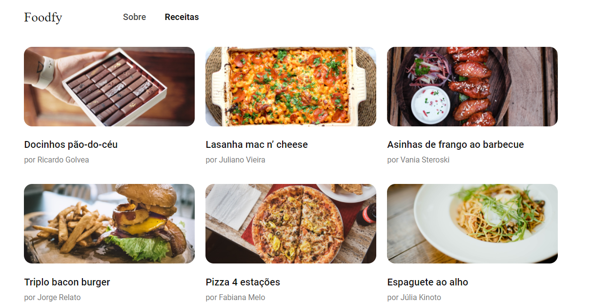

<h1>
  Foodfy - Desafio
</h1>

### Objetivo

Construir um site completo para de receitas chamada Foodfy.

### Página inicial

  

 

### Página de receitas

  

### Página de receitas

  

### Instruções e materiais 

As instruções e materiais necessários estão em um repositório da Rocketseat, [Acesse o material para Desafio Foodfy aqui](https://github.com/rocketseat-education/bootcamp-launchbase-desafios-02/blob/master/desafios/02-foodfy.md)

